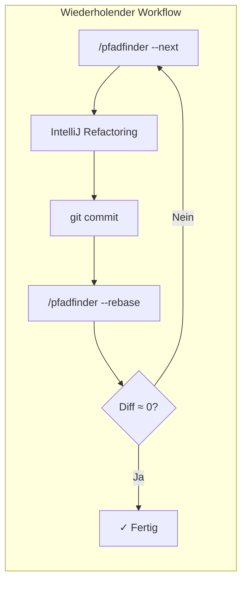

# Pfadfinder Refactoring Workflow

## Konzept

```
IST-Zustand (dein Branch)          SOLL-Zustand (Pfadfinder-Branch)
──────────────────────────          ────────────────────────────────
├── OldClass.java                   ├── NewClass.java (umbenannt)
├── BigService.java (500 Zeilen)    ├── BigService.java (300 Zeilen)
│                                   ├── ExtractedHelper.java (neu)
└── Controller.java (if-else)       └── Controller.java (switch)

         ──────────────────────────────────────────►
         Schrittweise Annäherung durch kleine Refactorings
```

Der **Pfadfinder-Branch** ist genau **1 Commit ahead** von deinem Implementierungsbranch.
Er zeigt den SOLL-Zustand - du näherst dich ihm schrittweise an:

1. Du machst ein kleines Refactoring (z.B. Rename)
2. Du commitest
3. Du rebasest den Pfadfinder auf deinen Branch → sein Diff wird kleiner
4. Wiederhole bis Diff ≈ 0



## Parameter

- `$ARGUMENTS` - Optionen: `--analyze`, `--next`, `--rebase`, `--status`, `--target-branch=<branch>`

## Kontext

- Aktueller Branch: !`git branch --show-current`
- Git Status: !`git status --short`

**Hinweis:** Führe `detect.sh` (im Verzeichnis dieser Skill-Datei) aus, um Branches zu finden die 1 Commit ahead sind.

## Workflow

### 1. Bestimme den Ziel-Branch

Falls kein `--target-branch` angegeben:

1. Suche nach Branches die **genau 1 Commit ahead** sind
2. Falls mehrere gefunden: Frage den User welcher verwendet werden soll
3. Falls keiner gefunden: Frage den User nach dem Branch-Namen

### 2. Action: --analyze (Default)

Analysiere den Diff zwischen aktuellem Branch und Pfadfinder-Branch:

```bash
git diff HEAD...<target-branch> --stat
git diff HEAD...<target-branch> --name-status
```

**Kategorisiere die Änderungen nach Typ:**

| Kategorie            | Erkennungsmuster              | Priorität   |
|----------------------|-------------------------------|-------------|
| **Rename**           | R100, R9x im name-status      | 1 (sicher)  |
| **Move**             | Pfad ändert sich, Name bleibt | 2 (sicher)  |
| **Extract Method**   | Neue private Methoden         | 3 (mittel)  |
| **Extract Class**    | Neue Klasse                   | 3 (mittel)  |
| **Change Signature** | Parameter ändern sich         | 5 (riskant) |
| **Semantisch**       | Logik ändert sich             | 6 (manuell) |

**Output Format:**

```
=== Pfadfinder Analyse ===
Ziel-Branch: <target-branch>
Aktueller Branch: <current-branch>

--- Empfohlene Reihenfolge ---

1. [RENAME] OldClass.java -> NewClass.java
   IntelliJ: Shift+F6
   Commit: "refactor: Rename OldClass to NewClass"

2. [EXTRACT] Methode xyz aus LargeClass
   IntelliJ: Cmd+Alt+M
   Commit: "refactor: Extract method xyz"
```

### 3. Action: --next

Zeige nur den nächsten empfohlenen Schritt mit detaillierter IntelliJ-Anleitung.

### 4. Action: --rebase

Führe das Rebase-Script aus:

```bash
# Script befindet sich im selben Verzeichnis wie diese SKILL.md
rebase.sh <impl-branch> <target-branch>
```

Dies rebasest den Pfadfinder-Branch auf deinen aktuellen Branch mit `-X theirs`,
sodass deine Refactorings übernommen werden und der Diff kleiner wird.

### 5. Action: --status

Zeige den aktuellen Fortschritt:

```bash
git diff HEAD...<target-branch> --stat | tail -1
```

## IntelliJ Shortcuts (Mac)

| Refactoring      | Shortcut  |
|------------------|-----------|
| Rename           | Shift+F6  |
| Move             | F6        |
| Extract Method   | Cmd+Alt+M |
| Extract Variable | Cmd+Alt+V |
| Inline           | Cmd+Alt+N |
| Change Signature | Cmd+F6    |

## Commit Message Format

```
<kurze Beschreibung>
```
